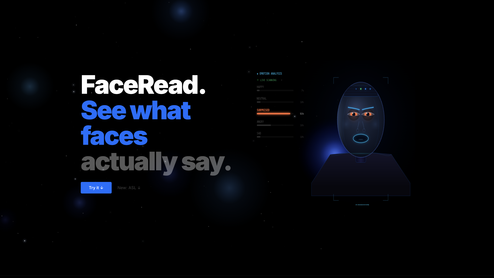

# FaceRead

Browser-based AI experiences for live emotion analysis, face recognition, and ASL fingerspelling.

**[Live Demo](https://face-read.vercel.app)** · **[GitHub](https://github.com/LightAnd2/FaceRead)**



## Overview

FaceRead is a webcam-native AI project focused on two live experiences exposed directly on the landing page: FaceRead for emotion analysis and local face recognition, and ASL Recognition for fingerspelled letter detection. The project combines browser-side vision models, a lightweight Flask backend, and a polished motion-driven interface to make live computer vision feel fast, approachable, and visual.

## Highlights

- Real-time facial emotion analysis directly in the browser using `face-api.js`
- Local face registration and matching so returning users can be identified by name
- ASL fingerspelling recognition backed by a Flask API and a trained local model
- Motion-rich React interface built to feel like a product, not just a model demo
- Privacy-friendly design for the core FaceRead mode, with client-side inference where possible

## Core Experiences

### FaceRead

The main experience uses webcam input to detect faces, estimate expressions, and overlay live emotion summaries on the video feed. Registered face descriptors are stored locally so the app can recognize saved people across sessions without requiring accounts or cloud storage.

### ASL Recognition

The ASL mode focuses on fingerspelled letter recognition from webcam landmarks. The frontend handles capture and visualization, while the Flask backend serves the classifier for prediction.

## Tech Stack

- **Frontend:** React, Vite, React Router, Framer Motion, Tailwind CSS
- **Vision / ML:** face-api.js, MediaPipe Tasks, DeepFace, scikit-learn/joblib
- **Backend:** Flask, Flask-CORS
- **Tooling:** Vercel Analytics, react-webcam, Recharts, Three.js

## Architecture

### Frontend

The frontend is responsible for:

- webcam capture
- live overlays and visualization
- client-side inference for the FaceRead experience
- landing-page-driven live experiences
- motion and presentation polish

### Backend

The Flask backend provides:

- ASL classification endpoints
- model loading and inference helpers
- support for modes that benefit from Python-side processing

## Project Structure

```text
FaceRead/
├── frontend/
│   ├── public/
│   └── src/
│       ├── components/
│       ├── modes/
│       └── pages/
├── backend/
│   ├── app.py
│   └── requirements.txt
├── docs/
│   └── images/
└── start.sh
```

## Local Setup

### 1. Install frontend dependencies

```bash
cd frontend
npm install
```

### 2. Set up the Python backend

```bash
cd backend
python3 -m venv venv
source venv/bin/activate
pip install -r requirements.txt
```

### 3. Run both services

From the project root:

```bash
./start.sh
```

### Local URLs

- Frontend: `http://localhost:3000`
- Backend: `http://localhost:5001`

## Notes

- FaceRead works best with steady lighting and a clear frontal face
- Saved face descriptors are stored locally in the browser
- Some modes are more experimental than others and are still evolving
- ASL recognition depends on the local backend model being available

## Why This Project Stands Out

FaceRead is not just a model wrapper. It is a product-style AI application that combines UX, live media processing, browser inference, and expressive presentation in one cohesive interface. The goal is to make real-time AI feel immediate, visual, and usable.
